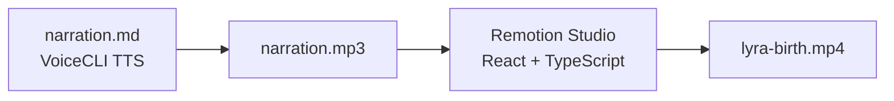

# roxabi-production

**Production assets for the Roxabi ecosystem — videos, media, and compiled outputs.**

[](https://github.com/Roxabi/roxabi-production)

Production-ready assets that ship alongside the Roxabi projects. Currently hosts the **Lyra birth video** — a narrated product video documenting Lyra's 52-day origin story, built with Remotion.

## Why

Keeping production assets separate from source repositories avoids bloating the main project repos with large binaries (MP4s, audio files) while still version-controlling the asset pipeline that generates them.

This repo is the single source of truth for all rendered media and compiled outputs from the Roxabi ecosystem.

## Contents

| Asset | Description |
|-------|-------------|
| `lyra-product-video/` | Remotion project — Lyra birth story video |
| `lyra-product-video/lyra-birth.mp4` | Final render (French narration, ~5 min) |
| `lyra-product-video/narration.mp3/wav` | Narration audio (Qwen/VoiceCLI generated) |

### lyra-product-video

A 17-scene animated video narrated by Lyra in French, recounting how the Roxabi ecosystem was built over 52 days — from a wrong bet on MCP to a 6-repo ecosystem.

| Scene | Title |
|-------|-------|
| 1 | Title |
| 2 | The Wrong Bet (MCP pivot) |
| 3 | Kill Your Darlings (LinkedIn skill removed) |
| 4 | Foundation (shared modules) |
| 5 | Radar (competitive intelligence) |
| 6 | Telegram (mobile-first) |
| 7 | Patch Notes (discipline) |
| 8 | Industrial (spec-first) |
| 9 | Lesson |
| 10 | The Day (3 systems born in parallel) |
| 11 | Voice (VoiceCLI) |
| 12 | The Night (first real conversation) |
| 13 | Identity (Lyra's name) |
| 14 | Ecosystem |
| 15 | Numbers (462 commits, 389 intel entries, 11 plugins) |
| 16 | Four Days (Lyra built in 4 days from 52 days of learning) |
| 17 | Closing |

## Quick Start

```bash
# Preview the video in Remotion Studio
cd lyra-product-video/lyra-video
npm install
npm run dev

# Render final MP4
npm run render
# → lyra-product-video/lyra-birth.mp4
```

## How it works



Narration is generated by [VoiceCLI](https://github.com/Roxabi/voiceCLI) using the `qwen-fast` engine. The video is composed in [Remotion](https://www.remotion.dev/) with 17 React scene components.

## Contributing

This is a private production asset repo. See the [Roxabi organization](https://github.com/Roxabi) for open-source projects.

## License

Private — all rights reserved.
