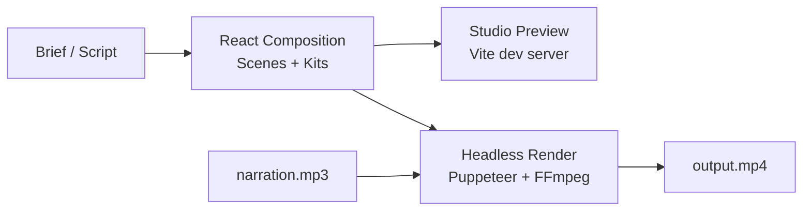

# roxabi-video-engine

**Programmatic video generation with React — 55 components, 13 kits, frame-based animation, headless MP4 rendering.**

[](https://github.com/Roxabi/roxabi-production)
[](https://github.com/Roxabi/roxabi-production)

A React-based video composition framework with 55 animated components across 13 kits. Write videos as code, preview in Studio, render to MP4 via headless Puppeteer + FFmpeg. Ships as a Claude Code plugin with skills for AI-assisted video generation.

## Why

Creating videos programmatically lets you version-control every frame, generate variations instantly, and compose complex animations from reusable building blocks. No timeline editors, no drag-and-drop — just React components and frame math.

## Install as Claude Code Plugin

```bash
claude plugin add Roxabi/roxabi-production
```

### Skills

| Skill | Trigger | Description |
|-------|---------|-------------|
| `generate` | "generate video", "create video" | Generate a complete video composition from a brief |
| `render` | "render video", "export mp4" | Render a composition to MP4 via Puppeteer + FFmpeg |
| `analyze` | "analyze video", "review composition" | Quality, timing, and completeness review |

## Quick Start

```bash
# Install dependencies
bun install

# Preview in Studio
bun run dev

# Generate a video (via Claude Code)
# "generate a 30s product intro video for Lyra"

# Render to MP4
bun run render <composition-id> output.mp4 --audio=narration.mp3
```

## Kits

| Kit | Components | Purpose |
|-----|-----------|---------|
| `kit-text` | Typewriter, FadeText, StaggeredWords, CountUp, GlitchText, WordByWord, StaggerLines | Text animation & typography |
| `kit-motion` | FadeIn, SlideIn, ScalePop, CameraShake, FlickerReveal, PulseGlow, NumberReveal | Motion & entrance animations |
| `kit-backgrounds` | GradientBackground, ParticleField, GridPattern, Glow | Backgrounds & patterns |
| `kit-cinema` | KenBurns, FilmGrain, Vignette, LightSweep, FloatingOrbs | Cinematic effects |
| `kit-dataviz` | AnimatedBar, ProgressRing, ProgressBar, AnimatedLine, AnimatedCounter | Data visualization |
| `kit-overlays` | SyncedCaptions, ImpactText, IconBadge, FloatingCards | Overlay elements |
| `kit-layout` | SlideBase, Chrome, Title, Body, Quote, TerminalBox, AccentBadge | Layout & structure |
| `kit-social` | LowerThird, SocialCard, CaptionOverlay | Social & broadcast |
| `kit-ui` | ChatInterface, PhoneFrame, LaptopFrame, BrowserTabs, EmailInbox, NotificationToast, Timer, BrandBadge, FlowDiagram | UI mockups |
| `kit-transitions` | SceneTransition | Scene transitions (10 types) |
| `kit-audio` | WaveformBars | Audio visualization |
| `kit-shapes` | AnimatedShape | Geometric animations |
| `kit-3d` | FloatingObject | 3D elements |

## How it works



### Architecture

```
core/           Frame primitives — useCurrentFrame, Sequence, interpolate, spring
lib/            Animation shortcuts — fadeIn, slideFrom, stagger
kits/           13 component kits (55 components)
themes/         Colors, accents, palettes (neon, mono, sunset, ocean, forest, candy, cyber)
player/         Interactive Studio + Player components
renderer/       Headless CLI — Puppeteer frame capture + FFmpeg encoding
dev/            Vite entry point + Studio dev server
skills/         Claude Code plugin skills (generate, render, analyze)
```

### Rendering Pipeline

1. Puppeteer launches headless browser on the Vite dev server
2. Navigates to `?mode=render&composition=<id>`
3. Captures each frame as PNG (frame-by-frame)
4. FFmpeg encodes frames to MP4 (h264, prores, or vp9) with optional audio sync
5. Cleanup temp files, output final video

### Composition Pattern

```tsx
import { useCurrentFrame, AbsoluteFill, Sequence } from './core'
import { FadeText, Typewriter } from './kits/kit-text'
import { FadeIn } from './kits/kit-motion'
import { SlideBase, Title } from './kits/kit-layout'
import { COLORS } from './themes'

const Scene1: React.FC = () => (
  <AbsoluteFill style={{ background: COLORS.bg }}>
    <SlideBase>
      <Title>Hello World</Title>
      <FadeIn delay={30}>
        <FadeText text="Built with code." delay={60} />
      </FadeIn>
    </SlideBase>
  </AbsoluteFill>
)

export const MyVideo: React.FC = () => (
  <AbsoluteFill>
    <Sequence from={0} durationInFrames={150}><Scene1 /></Sequence>
    <Sequence from={150} durationInFrames={120}><Scene2 /></Sequence>
  </AbsoluteFill>
)
```

## Contributing

See the [Roxabi organization](https://github.com/Roxabi) for related projects.

## License

MIT
