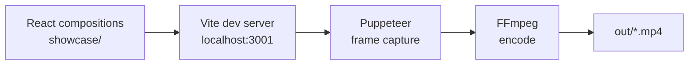

# roxabi-video-engine

**Custom React video engine for the Roxabi ecosystem — build animated videos with composable kits.**

[](https://github.com/Roxabi/roxabi-production)

A lightweight, Remotion-inspired video engine built from scratch with React + Vite + TypeScript. No Remotion dependency — frames are rendered via Puppeteer and encoded by FFmpeg. Ships with 14 component kits (~60 components) and a CLI renderer.

## Why

Building a custom engine gives full control over the render pipeline, composition API, and component design — without being tied to Remotion's runtime or pricing. The kit system makes it easy to compose new videos by assembling reusable scene primitives.

## Architecture

```
core/          → Animation primitives (interpolate, spring, useCurrentFrame, Sequence…)
lib/           → Utilities (cInterpolate, sprng helpers)
kits/          → 14 component kits (text, backgrounds, cinema, motion, UI, dataviz…)
renderer/      → Puppeteer + FFmpeg render pipeline (CLI)
showcase/      → Production compositions (LyraLaunchTrailer, ShowcaseVideo)
player/        → Browser preview (Vite dev server)
out/           → Rendered MP4 outputs
```



## Kits

| Kit | Components |
|-----|-----------|
| `kit-text` | `Typewriter`, `GlitchText`, `StaggeredWords`, `StaggerLines`, `FadeText`, `CountUp`, `WordByWord` |
| `kit-backgrounds` | `GradientBackground`, `ParticleField`, `GridPattern`, `BokehBackground`, `Glow` |
| `kit-cinema` | `FilmGrain`, `Vignette`, `LightSweep`, `FloatingOrbs`, `ChromaticAberration`, `GlitchOverlay`, `KenBurns`, `TunnelEffect`, `FogLayer`, `ImageFrame` |
| `kit-motion` | `FadeIn`, `SlideIn`, `ScalePop`, `PulseGlow`, `CameraShake`, `FlickerReveal`, `NumberReveal` |
| `kit-overlays` | `ImpactText`, `FloatingCards`, `IconBadge`, `SyncedCaptions` |
| `kit-ui` | `NotificationToast`, `ChatInterface`, `BrowserTabs`, `PhoneFrame`, `LaptopFrame`, `EmailInbox`, `FlowDiagram`, `GitHubCard`, `Timer`, `BrandBadge` |
| `kit-layout` | `SlideBase`, `Title`, `Body`, `Quote`, `Chrome`, `TextCard`, `TerminalBox`, `AccentBadge` |
| `kit-dataviz` | `AnimatedBar`, `AnimatedLine`, `AnimatedCounter`, `ProgressBar`, `ProgressRing`, `NeuralNetworkGraph` |
| `kit-transitions` | `SceneTransition` |
| `kit-social` | `SocialCard`, `LowerThird`, `CaptionOverlay` |
| `kit-shapes` | `AnimatedShape`, `PixelArtScene` |
| `kit-audio` | `WaveformBars` |
| `kit-3d` | `FloatingObject` |
| `kit-lyra` | `LyraLogo`, `ForgeTerminal`, `ForgeArchDiagram` |

## Quick Start

```bash
npm install

# Preview in browser (hot reload)
npm run dev
# → http://localhost:3001?composition=LyraLaunchTrailer

# Render to MP4
npm run render LyraLaunchTrailer
# → out/LyraLaunchTrailer.mp4

# Render with narration audio
npm run render LyraLaunchTrailer out/lyra-trailer.mp4 --audio=path/to/narration.mp3

# Type check
npm run typecheck
```

## Renderer

The render pipeline requires:
- A running Vite dev server on `localhost:3001`
- `puppeteer` (installed as devDependency)
- `ffmpeg` available in `$PATH`

The renderer navigates to `/?composition=<id>&mode=render`, reads `__ROXVID_DURATION__` from the window, captures frames one by one, then encodes with FFmpeg (h264 by default, CRF 18).

```bash
# CLI usage
npx tsx renderer/cli.ts <CompositionId> [output.mp4] [--audio=path]
```

## Showcase

| Composition | Description |
|-------------|-------------|
| `LyraLaunchTrailer` | Lyra launch trailer — Forge palette, cinematic FX |
| `ShowcaseVideo` | General showcase reel |

## Legacy

`lyra-product-video/` contains the original Remotion-based birth story video (17 scenes, French narration, ~5 min). It is standalone and not part of the new engine.

## Stack

- React 19 + TypeScript 5.7
- Vite 6 (dev server + build)
- Puppeteer 24 (headless frame capture)
- FFmpeg (video encoding)
- Vitest 3 (unit tests)

## License

Private — all rights reserved.
