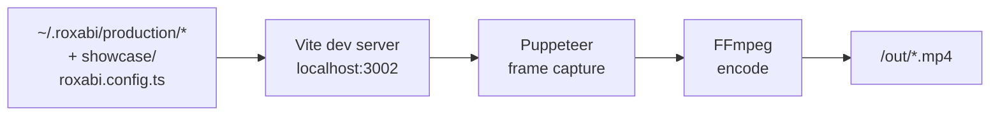

# roxabi-video-engine

**Custom React video engine for the Roxabi ecosystem — build animated videos with composable kits.**

[](https://github.com/Roxabi/roxabi-production)

A lightweight, Remotion-inspired video engine built from scratch with React + Vite + TypeScript. No Remotion dependency — frames are rendered via Puppeteer and encoded by FFmpeg. Ships with 14 component kits (~60 components) and a CLI renderer.

## Why

Building a custom engine gives full control over the render pipeline, composition API, and component design — without being tied to Remotion's runtime or pricing. The kit system makes it easy to compose new videos by assembling reusable scene primitives.

## Architecture

> See [Determinism Contract](./CLAUDE.md#video-engine-determinism-contract) for invariants compositions must respect.

```
core/          → Animation primitives (interpolate, spring, useCurrentFrame, Sequence…)
lib/           → Utilities (cInterpolate, sprng helpers)
kits/          → 14 component kits (text, backgrounds, cinema, motion, UI, dataviz…)
renderer/      → Puppeteer + FFmpeg render pipeline (CLI)
player/        → Browser preview (Vite dev server)
showcase/      → In-repo demo composition (engine-local)
config/        → Production discovery + path helpers
plugins/       → Claude Code plugin (skills for compose/produce/render…)
```

Productions (your videos) live **outside the repo** under
`~/.roxabi/production/<projet>-video/` and are auto-discovered by Vite.



## Kits

| Kit | Components |
|-----|-----------|
| `kit-text` | `Typewriter`, `GlitchText`, `StaggeredWords`, `StaggerLines`, `FadeText`, `CountUp`, `WordByWord` |
| `kit-backgrounds` | `GradientBackground`, `ParticleField`, `GridPattern`, `BokehBackground`, `Glow` |
| `kit-cinema` | `FilmGrain`, `Vignette`, `LightSweep`, `FloatingOrbs`, `ChromaticAberration`, `GlitchOverlay`, `KenBurns`, `TunnelEffect`, `FogLayer`, `ImageFrame` |
| `kit-motion` | `FadeIn`, `SlideIn`, `ScalePop`, `PulseGlow`, `CameraShake`, `FlickerReveal`, `NumberReveal` |
| `kit-overlays` | `ImpactText`, `FloatingCards`, `IconBadge`, `SyncedCaptions` |
| `kit-ui` | `NotificationToast`, `ChatInterface`, `BrowserTabs`, `PhoneFrame`, `LaptopFrame`, `EmailInbox`, `FlowDiagram`, `GitHubCard`, `Timer`, `BrandBadge` |
| `kit-layout` | `SlideBase`, `Title`, `Body`, `Quote`, `Chrome`, `TextCard`, `TerminalBox`, `AccentBadge` |
| `kit-dataviz` | `AnimatedBar`, `AnimatedLine`, `AnimatedCounter`, `ProgressBar`, `ProgressRing`, `NeuralNetworkGraph` |
| `kit-transitions` | `SceneTransition` |
| `kit-social` | `SocialCard`, `LowerThird`, `CaptionOverlay` |
| `kit-shapes` | `AnimatedShape`, `PixelArtScene` |
| `kit-audio` | `WaveformBars` |
| `kit-3d` | `FloatingObject` |
| `kit-lyra` | `LyraLogo`, `ForgeTerminal`, `ForgeArchDiagram` |

## Quick Start

```bash
bun install

# Preview in browser (hot reload)
bun run dev
# → http://localhost:3002?composition=showcase

# Render to MP4 (default output → <production-dir>/out/<id>.mp4)
bun run render showcase

# Render with narration audio
bun run render showcase --audio=path/to/narration.wav

# Pre-render gates (determinism, contrast, overflow)
bun run render showcase --strict

# Type check + tests
bun run typecheck
bun run test
```

## Renderer

The render pipeline requires:
- A running Vite dev server on `localhost:3002` (override via `ROXVID_PORT`)
- `puppeteer` (installed as devDependency)
- `ffmpeg` available in `$PATH`

The renderer navigates to `/?composition=<id>&mode=render`, reads `__ROXVID_DURATION__` from the window, captures frames one by one, then encodes with FFmpeg (h264 by default, CRF 18).

```bash
# CLI usage
bun run render <CompositionId> [output.mp4] [--audio=path] [--strict]
```

## Productions

A production is a directory containing one or more compositions plus their
content/assets. The engine discovers them at boot via `roxabi.config.ts` files.

**Default location:** `~/.roxabi/production/<projet>-video/` — override with
`ROXABI_PRODUCTION_DIR=/some/other/path`.

```
~/.roxabi/production/<projet>-video/
├── compositions/        # *.tsx (use @core, @kits, @lib, @themes aliases)
├── content/             # vo.md, soundtrack.md, scripts
├── assets/              # narration.wav, marks/, raw audio
├── out/                 # rendered mp4 (gitignored locally)
└── roxabi.config.ts     # registers compositions:
                         #   import { MyComp } from './compositions/MyComp'
                         #   export default [{ id, component, durationInFrames, fps, width, height }]
```

The `showcase/` directory in this repo is a built-in demo following the same
convention — see [`showcase/README.md`](./showcase/README.md).

## Stack

- React 19 + TypeScript 5.7+
- Vite 8 (dev server + build)
- Puppeteer 24 (headless frame capture)
- FFmpeg (video encoding)
- Vitest 4 (unit tests)
- Bun (runtime + package manager)

## License

MIT — see [LICENSE](./LICENSE).
