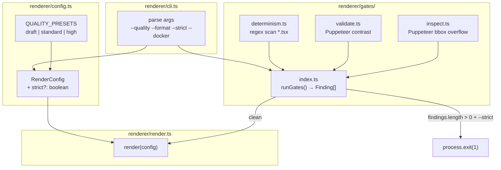
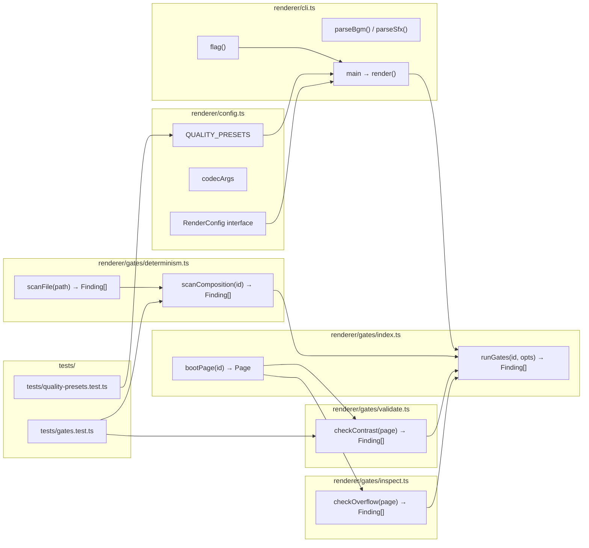

## Summary

Add a `renderer/gates/` subsystem (determinism scan · contrast validate · overflow inspect) and wire a `--strict` flag that aborts render on any gate violation. Extend `renderer/cli.ts` with `--quality` presets and `--format` alias; introduce ESLint `no-restricted-syntax` to catch non-determinism at author-time; codify the determinism contract in a new project-root `CLAUDE.md`.

## Architecture

### Data Flow



### File × Function Map



## Bootstrap Context

- `renderer/cli.ts:flag()` — existing helper, pattern to follow for new flags
- `renderer/render.ts:render()` — Puppeteer launch/page/navigate pattern reused by gates
- `renderer/config.ts:codecArgs` — record map pattern; replicate for `QUALITY_PRESETS`
- `core/random.ts` — seeded PRNG; the only approved randomness source (excluded from ESLint rule)

## Agents

| Agent instance | Tasks | Files |
|---|---|---|
| `backend-dev-A` | T1, T5, T7 | `renderer/cli.ts`, `renderer/config.ts`, `renderer/gates/validate.ts`, `renderer/gates/index.ts` |
| `backend-dev-B` | T2, T6 | `renderer/gates/determinism.ts`, `renderer/gates/inspect.ts` |
| `devops-A` | T3 | `eslint.config.js`, `package.json` |
| `doc-writer-A` | T4 | `CLAUDE.md` |
| `tester-A` | T8, T9 | `tests/gates.test.ts`, `tests/quality-presets.test.ts` |

## Wave Structure

3 waves, max 4 parallel agents. Elapsed ~2 sessions vs ~5 sequential.

| Wave | Trigger | Agents | Tasks |
|---|---|---|---|
| 1 | start | 4 ∥ | `backend-dev-A`: T1 · `backend-dev-B`: T2 · `devops-A`: T3 · `doc-writer-A`: T4 |
| 2 | Wave 1 done | 2 ∥ | `backend-dev-A`: T5→T7 · `backend-dev-B`: T6 |
| 3 | Wave 2 done | 1 | `tester-A`: T8→T9 |

---

## Micro-Tasks

### Wave 1 — no deps, 4 agents ∥

---

#### T1 — backend-dev-A — Quality/format CLI flags [P] [parallel-safe: Y]

**Phase:** GREEN | **Slice:** V1 | **Difficulty:** 2 | **Time:** ~20 min

Add `QUALITY_PRESETS` to `renderer/config.ts` and wire `--quality`, `--format`, `--strict`, `--docker` in `renderer/cli.ts`.

**Files:**
- `renderer/config.ts` — add `QUALITY_PRESETS` record + extend `RenderConfig`
- `renderer/cli.ts` — parse new flags, apply preset before calling `render()`

**Code shape — config.ts:**
```ts
export const QUALITY_PRESETS: Record<'draft' | 'standard' | 'high', { crf: number; scale: number }> = {
  draft:    { crf: 28, scale: 1 },
  standard: { crf: 18, scale: 1 },
  high:     { crf: 14, scale: 1 },
}

// Extend RenderConfig
export interface RenderConfig {
  // ...existing...
  strict?: boolean
}
```

**Code shape — cli.ts (additions):**
```ts
// --quality preset (overrides --crf if both given)
const quality = flag('quality') as 'draft' | 'standard' | 'high' | undefined
const preset = quality ? QUALITY_PRESETS[quality] : undefined

// --format as codec alias: mp4→h264, webm→vp9
const format = flag('format')
const codecFromFormat = format === 'webm' ? 'vp9' : format === 'mp4' ? 'h264' : undefined

// --strict
const strict = args.includes('--strict')

// --docker: stub
if (args.includes('--docker')) {
  console.warn('--docker: not yet implemented, rendering locally')
}

render({
  // ...existing...
  crf:    preset?.crf ?? (flag('crf') ? parseInt(flag('crf')!) : undefined),
  codec:  (flag('codec') ?? codecFromFormat) as 'h264' | 'prores' | 'vp9' | undefined,
  strict,
})
```

**Verify:**
```bash
npx tsx renderer/cli.ts lyra-launch-trailer out/test-draft.mp4 --quality=draft --fps=24
# → should render at CRF 28
npx tsx renderer/cli.ts lyra-launch-trailer out/test.webm --format=webm
# → should use vp9 codec, .webm output
```
**Expected:** render succeeds, `--strict` flag accepted (no-op until T7), `--docker` logs warning.

**Spec trace:** #27

---

#### T2 — backend-dev-B — Determinism gate module [P] [parallel-safe: Y]

**Phase:** GREEN | **Slice:** V1 | **Difficulty:** 2 | **Time:** ~20 min

Create `renderer/gates/determinism.ts` — regex-based scan of composition + kit source files.

**Files:**
- `renderer/gates/determinism.ts` — new file

**Code shape:**
```ts
import * as fs from 'fs'
import * as path from 'path'
import * as glob from 'fs'

export interface Finding {
  gate: 'determinism' | 'contrast' | 'overflow'
  severity: 'error' | 'warning'
  file: string
  line: number
  message: string
}

const BANNED = [
  { pattern: /\bMath\.random\s*\(\)/g,      message: 'Math.random() is non-deterministic — use random() from core/random.ts' },
  { pattern: /\bDate\.now\s*\(\)/g,          message: 'Date.now() is non-deterministic — derive time from frame + fps' },
  { pattern: /\bperformance\.now\s*\(\)/g,   message: 'performance.now() is non-deterministic — derive time from frame + fps' },
]

export function scanFile(filePath: string): Finding[] {
  const content = fs.readFileSync(filePath, 'utf8')
  const lines = content.split('\n')
  const findings: Finding[] = []
  for (const { pattern, message } of BANNED) {
    for (let i = 0; i < lines.length; i++) {
      pattern.lastIndex = 0
      if (pattern.test(lines[i])) {
        findings.push({ gate: 'determinism', severity: 'error', file: filePath, line: i + 1, message })
      }
    }
  }
  return findings
}

export function scanComposition(root: string): Finding[] {
  const dirs = [path.join(root, 'showcase'), path.join(root, 'kits')]
  const findings: Finding[] = []
  for (const dir of dirs) {
    if (!fs.existsSync(dir)) continue
    const walk = (d: string) => {
      for (const entry of fs.readdirSync(d, { withFileTypes: true })) {
        const full = path.join(d, entry.name)
        if (entry.isDirectory()) walk(full)
        else if (entry.name.endsWith('.tsx') || entry.name.endsWith('.ts')) {
          findings.push(...scanFile(full))
        }
      }
    }
    walk(dir)
  }
  return findings
}
```

**Verify:**
```bash
cd /home/mickael/projects/roxabi-production
node -e "const {scanComposition}=require('./renderer/gates/determinism.ts'); console.log(scanComposition('.'))"
# OR via tsx:
npx tsx -e "import {scanComposition} from './renderer/gates/determinism.ts'; console.log(JSON.stringify(scanComposition('.'), null, 2))"
```
**Expected:** empty array `[]` (no existing violations confirmed by grep audit).

**Spec trace:** #28, #29

---

#### T3 — devops-A — ESLint setup [P] [parallel-safe: Y]

**Phase:** GREEN | **Slice:** V1 | **Difficulty:** 2 | **Time:** ~15 min

Bootstrap ESLint with `no-restricted-syntax` covering the determinism rules.

**Files:**
- `eslint.config.js` — new (flat config)
- `package.json` — add eslint devDep, update `lint` script

**Code shape — eslint.config.js:**
```js
import tsParser from '@typescript-eslint/parser'

export default [
  {
    files: ['showcase/**/*.{ts,tsx}', 'kits/**/*.{ts,tsx}'],
    languageOptions: { parser: tsParser },
    rules: {
      'no-restricted-syntax': ['error',
        {
          selector: "CallExpression[callee.object.name='Math'][callee.property.name='random']",
          message: 'Math.random() is non-deterministic — use random() from core/random.ts',
        },
        {
          selector: "CallExpression[callee.object.name='Date'][callee.property.name='now']",
          message: 'Date.now() is non-deterministic — derive time from useCurrentFrame() + fps',
        },
        {
          selector: "CallExpression[callee.object.name='performance'][callee.property.name='now']",
          message: 'performance.now() is non-deterministic — derive time from useCurrentFrame() + fps',
        },
        {
          selector: "CallExpression[callee.property.name='play'][callee.object.type!='ThisExpression']",
          message: 'Do not call .play() on media elements — audio is handled by FFmpeg --audio flag',
        },
      ],
    },
  },
]
```

**package.json lint script:**
```json
"lint": "tsc --noEmit && eslint showcase kits --max-warnings=0"
```

**Install:**
```bash
npm install --save-dev eslint @typescript-eslint/parser
```

**Verify:**
```bash
npm run lint
```
**Expected:** exits 0 (no violations in existing files).

**Spec trace:** #29

---

#### T4 — doc-writer-A — CLAUDE.md determinism contract [P] [parallel-safe: Y]

**Phase:** GREEN | **Slice:** V1 | **Difficulty:** 1 | **Time:** ~10 min

Create project-root `CLAUDE.md` with video-engine determinism contract.

**Files:**
- `CLAUDE.md` — new

**Content shape:**
```markdown
# roxabi-production — Project Rules

## Video Engine Determinism Contract

The Puppeteer frame-capture pipeline requires fully deterministic compositions.
Violations produce frame jitter, broken audio sync, and unreproducible bugs.

| Rule | Rationale | Approved alternative |
|---|---|---|
| No `Math.random()` | Non-deterministic across renders | `random(seed)` from `core/random.ts` |
| No `Date.now()` | Wall-clock varies | Derive seconds: `frame / fps` |
| No `performance.now()` | Same as above | `frame / fps` |
| No `.play()` on `<video>`/`<audio>` | Autoplay blocked; audio via FFmpeg | Pass `--audio=` to renderer CLI |
| No `<video>` without `muted` | Causes playback errors | `<video muted>` + separate audio track |
| Caption groups must reset opacity at boundary | Bleeds into next scene | `opacity: frame >= groupEnd ? 0 : 1` |
| No infinite loops in animations | Capture needs finite duration | Calculate finite repeat counts from `durationInFrames` |

### Enforcement

- **Runtime (pre-render):** `npm run render <id> --strict` → `renderer/gates/determinism.ts`
- **Author-time (IDE):** `npm run lint` → `eslint.config.js` `no-restricted-syntax`

### References

- Seeded PRNG: `core/random.ts`
- Gate runner: `renderer/gates/index.ts`
- Pattern origin: [HyperFrames skill](https://github.com/NousResearch/hermes-agent/blob/main/optional-skills/creative/hyperframes/SKILL.md)
```

**Verify:**
```bash
cat CLAUDE.md | grep "Determinism Contract"
```
**Expected:** line found.

**Spec trace:** #30

---

### Wave 2 — after Wave 1, 2 agents ∥

---

#### T5 — backend-dev-A — Contrast validation gate [parallel-safe: N, deps: T1+T2]

**Phase:** GREEN | **Slice:** V2 | **Difficulty:** 3 | **Time:** ~30 min

Create `renderer/gates/validate.ts` — launch Puppeteer, navigate to hero frame (frame 0), sample text/bg colors, compute WCAG contrast ratio.

**Files:**
- `renderer/gates/validate.ts` — new

**Code shape:**
```ts
import puppeteer from 'puppeteer'
import type { Finding } from './determinism'

function relativeLuminance(r: number, g: number, b: number): number {
  const sRGB = [r, g, b].map(c => {
    c /= 255
    return c <= 0.04045 ? c / 12.92 : Math.pow((c + 0.055) / 1.055, 2.4)
  })
  return 0.2126 * sRGB[0] + 0.7152 * sRGB[1] + 0.0722 * sRGB[2]
}

function contrastRatio(l1: number, l2: number): number {
  const lighter = Math.max(l1, l2)
  const darker  = Math.min(l1, l2)
  return (lighter + 0.05) / (darker + 0.05)
}

export async function checkContrast(
  page: import('puppeteer').Page,
  threshold = 4.5,
): Promise<Finding[]> {
  // Sample text elements' computed fg + bg
  const findings: Finding[] = []
  const violations = await page.evaluate((thr: number) => {
    const results: { selector: string; ratio: number }[] = []
    const els = document.querySelectorAll('p, span, h1, h2, h3, h4, div[style*="color"]')
    for (const el of Array.from(els)) {
      const style = getComputedStyle(el)
      const fg = style.color
      const bg = style.backgroundColor
      // crude parse: skip transparent
      if (!fg || !bg || bg === 'rgba(0, 0, 0, 0)') continue
      // ... compute ratio, push if < threshold
    }
    return results
  }, threshold)

  for (const v of violations) {
    findings.push({
      gate: 'contrast',
      severity: 'warning',
      file: v.selector,
      line: 0,
      message: `Contrast ratio ${v.ratio.toFixed(2)} < ${threshold} (WCAG AA)`,
    })
  }
  return findings
}
```

**Verify:**
```bash
npx tsx -e "
import puppeteer from 'puppeteer'
import {checkContrast} from './renderer/gates/validate.ts'
const b = await puppeteer.launch({headless:true})
const p = await b.newPage()
await p.goto('http://localhost:3002?composition=lyra-launch-trailer&mode=render')
await p.waitForSelector('#render-root')
console.log(await checkContrast(p))
await b.close()
"
```
**Expected:** array of findings (may be empty for Forge palette dark-on-dark).

**Spec trace:** #28

---

#### T6 — backend-dev-B — Layout overflow inspection gate [parallel-safe: N, deps: T2]

**Phase:** GREEN | **Slice:** V2 | **Difficulty:** 3 | **Time:** ~25 min

Create `renderer/gates/inspect.ts` — find elements whose bounding rect extends beyond the viewport.

**Files:**
- `renderer/gates/inspect.ts` — new

**Code shape:**
```ts
import type { Finding } from './determinism'

export async function checkOverflow(
  page: import('puppeteer').Page,
  viewportWidth = 1920,
  viewportHeight = 1080,
): Promise<Finding[]> {
  const violations = await page.evaluate(
    (vw: number, vh: number) => {
      const results: { tag: string; id: string; rect: DOMRect }[] = []
      const els = document.querySelectorAll('*')
      for (const el of Array.from(els)) {
        const r = el.getBoundingClientRect()
        if (r.right > vw || r.bottom > vh || r.left < 0 || r.top < 0) {
          results.push({
            tag: el.tagName.toLowerCase(),
            id: (el as HTMLElement).id || (el as HTMLElement).className?.toString().slice(0, 40) || '',
            rect: { top: r.top, left: r.left, right: r.right, bottom: r.bottom } as unknown as DOMRect,
          })
        }
      }
      return results
    },
    viewportWidth,
    viewportHeight,
  )

  return violations.map(v => ({
    gate: 'overflow' as const,
    severity: 'error' as const,
    file: `<${v.tag}${v.id ? ` id="${v.id}"` : ''}>`,
    line: 0,
    message: `Element overflows viewport: top=${v.rect.top} left=${v.rect.left} right=${v.rect.right} bottom=${v.rect.bottom}`,
  }))
}
```

**Verify:**
```bash
npx tsx -e "
import puppeteer from 'puppeteer'
import {checkOverflow} from './renderer/gates/inspect.ts'
const b = await puppeteer.launch({headless:true})
const p = await b.newPage()
await p.setViewport({width:1920,height:1080})
await p.goto('http://localhost:3002?composition=lyra-launch-trailer&mode=render')
await p.waitForSelector('#render-root')
console.log(await checkOverflow(p))
await b.close()
"
```
**Expected:** empty array for existing compositions.

**Spec trace:** #28

---

#### T7 — backend-dev-A — Gate runner + --strict wiring [deps: T5+T6]

**Phase:** GREEN | **Slice:** V2 | **Difficulty:** 3 | **Time:** ~25 min

Create `renderer/gates/index.ts` as the orchestrator. Wire `strict` flag in `render.ts` (or as a pre-render call in `cli.ts`).

**Files:**
- `renderer/gates/index.ts` — new
- `renderer/cli.ts` — call `runGates()` before `render()` when `--strict`

**Code shape — gates/index.ts:**
```ts
import puppeteer from 'puppeteer'
import { scanComposition, type Finding } from './determinism'
import { checkContrast } from './validate'
import { checkOverflow } from './inspect'

export type { Finding }

export async function runGates(
  compositionId: string,
  root: string,
  serverUrl: string,
  opts: { contrast?: boolean; overflow?: boolean; determinism?: boolean } = {},
): Promise<Finding[]> {
  const all = opts.determinism !== false
  const findings: Finding[] = []

  // 1. Static: determinism (no server needed)
  if (opts.determinism !== false) {
    findings.push(...scanComposition(root))
  }

  // 2. Puppeteer: contrast + overflow
  const needsPup = opts.contrast !== false || opts.overflow !== false
  if (needsPup) {
    const browser = await puppeteer.launch({ headless: true, args: ['--window-size=1920,1080'] })
    const page = await browser.newPage()
    await page.setViewport({ width: 1920, height: 1080 })
    await page.goto(`${serverUrl}?composition=${encodeURIComponent(compositionId)}&mode=render`)
    await page.waitForSelector('#render-root', { timeout: 10000 })
    if (opts.contrast !== false) findings.push(...await checkContrast(page))
    if (opts.overflow !== false) findings.push(...await checkOverflow(page))
    await browser.close()
  }

  return findings
}
```

**Code shape — cli.ts additions (before render() call):**
```ts
if (strict) {
  console.log('Running pre-render gates (--strict)...')
  const { runGates } = await import('./gates/index')
  const findings = await runGates(compositionId, process.cwd(), serverUrl)
  if (findings.length > 0) {
    console.error('\nPre-render gate violations:')
    for (const f of findings) {
      console.error(`  [${f.gate}] ${f.file}:${f.line} — ${f.message}`)
    }
    process.exit(1)
  }
  console.log('Gates passed.\n')
}
```

**Verify:**
```bash
npx tsx renderer/cli.ts lyra-launch-trailer out/test.mp4 --strict
# → should print "Gates passed." then render
```
**Expected:** gates pass on existing compositions, render proceeds normally.

**Spec trace:** #27, #28

---

### RED-GATE: Wave 2 complete — gates module functional, --strict wires to findings

*Verify before proceeding to Wave 3:*
```bash
npx tsx renderer/cli.ts lyra-launch-trailer out/gate-test.mp4 --strict
# Must print "Gates passed." — exit 0
```

---

### Wave 3 — after Wave 2, 1 agent

---

#### T8 — tester-A — Unit tests [deps: T7]

**Phase:** GREEN | **Slice:** V3 | **Difficulty:** 2 | **Time:** ~20 min

Unit tests for determinism scanner and quality preset mapping.

**Files:**
- `tests/gates.test.ts` — new
- `tests/quality-presets.test.ts` — new

**Code shape — gates.test.ts:**
```ts
import { describe, it, expect } from 'vitest'
import * as fs from 'fs'
import * as os from 'os'
import * as path from 'path'
import { scanFile } from '../renderer/gates/determinism'

describe('determinism gate', () => {
  it('flags Math.random()', () => {
    const f = path.join(os.tmpdir(), 'test-det.tsx')
    fs.writeFileSync(f, 'const x = Math.random()\n')
    const findings = scanFile(f)
    expect(findings).toHaveLength(1)
    expect(findings[0].message).toContain('Math.random()')
    fs.unlinkSync(f)
  })

  it('passes clean file', () => {
    const f = path.join(os.tmpdir(), 'clean.tsx')
    fs.writeFileSync(f, 'const x = random("seed")\n')
    expect(scanFile(f)).toHaveLength(0)
    fs.unlinkSync(f)
  })

  it('flags Date.now()', () => {
    const f = path.join(os.tmpdir(), 'test-date.tsx')
    fs.writeFileSync(f, 'const t = Date.now()\n')
    const findings = scanFile(f)
    expect(findings[0].gate).toBe('determinism')
    fs.unlinkSync(f)
  })
})
```

**Code shape — quality-presets.test.ts:**
```ts
import { describe, it, expect } from 'vitest'
import { QUALITY_PRESETS } from '../renderer/config'

describe('quality presets', () => {
  it('draft has higher CRF than standard', () => {
    expect(QUALITY_PRESETS.draft.crf).toBeGreaterThan(QUALITY_PRESETS.standard.crf)
  })
  it('high has lower CRF than standard', () => {
    expect(QUALITY_PRESETS.high.crf).toBeLessThan(QUALITY_PRESETS.standard.crf)
  })
  it('all presets defined', () => {
    expect(QUALITY_PRESETS).toHaveProperty('draft')
    expect(QUALITY_PRESETS).toHaveProperty('standard')
    expect(QUALITY_PRESETS).toHaveProperty('high')
  })
})
```

**Verify:**
```bash
npm test
```
**Expected:** all tests pass, 0 failures.

**Spec trace:** #27, #28, #29

---

#### T9 — tester-A — Showcase gate audit [deps: T8]

**Phase:** GREEN | **Slice:** V3 | **Difficulty:** 2 | **Time:** ~15 min

Run all 3 gates against the 4 existing showcase compositions with dev server running. Document results.

**Files:**
- No code changes expected; fix any violations found

**Verify:**
```bash
# Requires: npm run dev running on :3002
for comp in roxabi-trailer lyra-launch-trailer qaya-tldr showcase; do
  echo "=== $comp ==="
  npx tsx renderer/cli.ts $comp /dev/null --strict 2>&1 | head -20
done
```
**Expected:**
- `determinism` gate: 0 findings for all (confirmed by grep audit)
- `overflow` gate: 0 findings (compositions use `overflow:hidden` + AbsoluteFill)
- `contrast` gate: possible warnings for Forge dark palette (severity=warning, ¬error → does not fail `--strict`)

**Spec trace:** #26 acceptance criteria

---

## Consistency Report

| Issue | Criteria covered | Tasks |
|---|---|---|
| #27 render flags | `--quality`, `--format`, `--strict`, `--docker` | T1, T7 |
| #28 validation gates | `lint`, `validate`, `inspect`, `--strict` wiring | T2, T5, T6, T7 |
| #29 ESLint rule | `no-restricted-syntax`, `npm run lint` updated | T3 |
| #30 CLAUDE.md | contract table, enforcement section | T4 |

Uncovered: `--docker` full implementation (stub only, per issue scope). Exempted by design.

---

## Task Seeding Blueprint

<!-- Used by /implement to seed TaskCreate calls on session start. -->

### Wave 1 — no deps, 4 agents ∥

| Task | Agent instance | blockedBy | Subject |
|---|---|---|---|
| T1 | backend-dev-A | — | Add --quality presets, --format alias, --strict, --docker stub to renderer |
| T2 | backend-dev-B | — | Create renderer/gates/determinism.ts — regex scan for non-deterministic calls |
| T3 | devops-A | — | Bootstrap ESLint with no-restricted-syntax rules for compositions |
| T4 | doc-writer-A | — | Create CLAUDE.md with video-engine determinism contract |

### Wave 2 — after Wave 1, 2 agents ∥

| Task | Agent instance | blockedBy | Subject |
|---|---|---|---|
| T5 | backend-dev-A | T1,T2 | Create renderer/gates/validate.ts — Puppeteer contrast check |
| T6 | backend-dev-B | T2 | Create renderer/gates/inspect.ts — Puppeteer bbox overflow check |
| T7 | backend-dev-A | T5,T6 | Create renderer/gates/index.ts + wire --strict in cli.ts |

### Wave 3 — after Wave 2, 1 agent

| Task | Agent instance | blockedBy | Subject |
|---|---|---|---|
| T8 | tester-A | T7 | Write unit tests for determinism gate + quality presets |
| T9 | tester-A | T8 | Audit all 4 showcase compositions through all 3 gates |

## Task IDs

<!-- Generated by /plan. Used by /implement to resume tasks on session restart. -->
- T1: 1 — Add --quality presets, --format alias, --strict, --docker stub to renderer
- T2: 2 — Create renderer/gates/determinism.ts — regex scan for non-deterministic calls
- T3: 3 — Bootstrap ESLint with no-restricted-syntax rules for compositions
- T4: 4 — Create CLAUDE.md with video-engine determinism contract
- T5: 5 — Create renderer/gates/validate.ts — Puppeteer WCAG contrast check
- T6: 6 — Create renderer/gates/inspect.ts — Puppeteer bbox overflow check
- T7: 7 — Create renderer/gates/index.ts + wire --strict in cli.ts
- T8: 8 — Write unit tests for determinism gate and quality presets
- T9: 9 — Audit all 4 showcase compositions through all 3 gates
